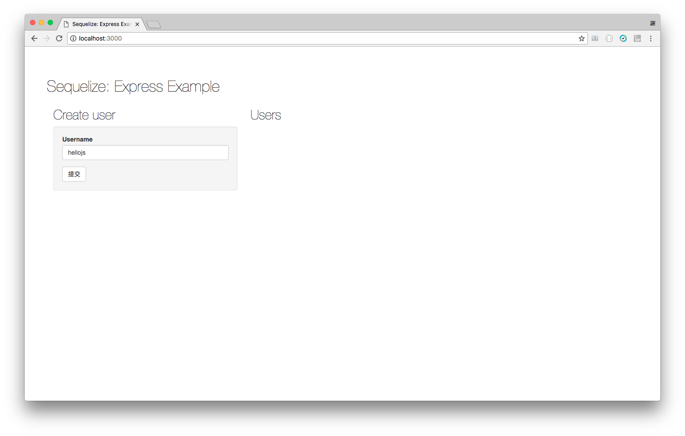

# 運行範例專案


## 範例專案網址

* <https://github.com/agileworks-tw/express-example>
* <https://github.com/agileworks-tw/express-example-vue>

請先將上述兩個專案 fork 回您個人的 github 帳號。

## server side

```
git clone https://github.com/${yourname}/express-example.git
```

```
cd express-example
npm install
node_modules/.bin/sequelize db:migrate
npm start
```

運行網址: <http://localhost:3000/>

> 請先在後台再 username 輸入 hellojs 並新增如下圖




### 資料結構說明

```
.
├── README.md

├── app.js          程式進入點

├── package.json    此專案用到的套件
├── config          設定檔

├── models          資料表 ORM 定義
├── migrations      資料庫遷移檔

├── routes          controller 及 API path 定義

├── views           後台前端頁面
├── public          靜態檔案

├── test            測試案例


```


## client side

```
git clone https://github.com/${yourname}/express-example-vue.git
```

```
npm install
npm run dev
```

運行網址: <http://localhost:4000/>

### 資料結構說明

```
.
├── README.md
├── index.html
├── package.json

├── build                   建置相關所需檔案
├── config                  設定檔
│   ├── dev.env.js          development config 
│   ├── index.js
│   └── prod.env.js         production config
├── src
│   ├── App.vue
│   ├── main.js
│   ├── assets
│   └── components
│       ├── ToDo.vue        ToDo 顯示
│       ├── ToDoForm.vue    ToDo 新增表單
│       └── TodoList.vue    ToDo 清單及 API 呼叫
└── static

```

