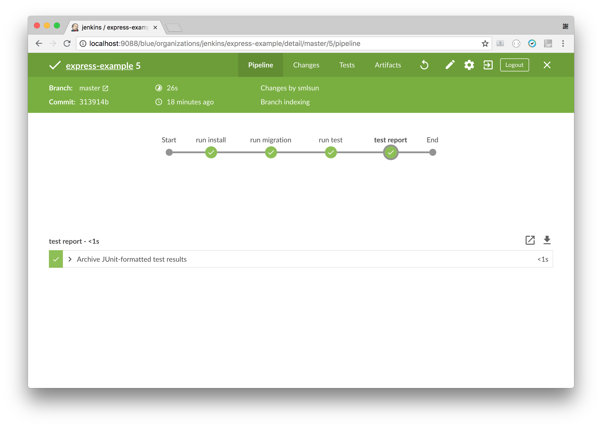
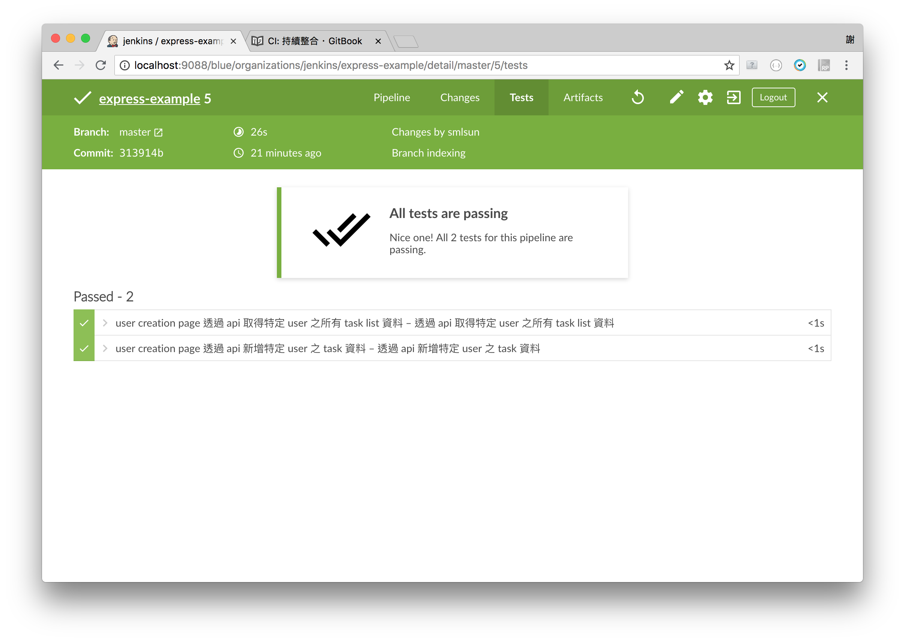

# CI: 持續整合






## Jenkinsfile

```
pipeline {
  agent {
    docker {
      image 'node:8-alpine'
    }

  }
  stages {
    stage('run install') {
      steps {
        sh 'npm install'
      }
    }
    stage('run migration') {
      steps {
        sh 'node_modules/.bin/sequelize db:migrate'
      }
    }
    stage('run test') {
      steps {
        sh 'npm run test-jenkins'
      }
    }
    stage('test report') {
      steps {
        junit(testResults: 'jenkins-test-results.xml', allowEmptyResults: true)
      }
    }
  }
  environment {
    npm_config_cache = 'npm-cache'
    HOME = '.'
  }
}
```