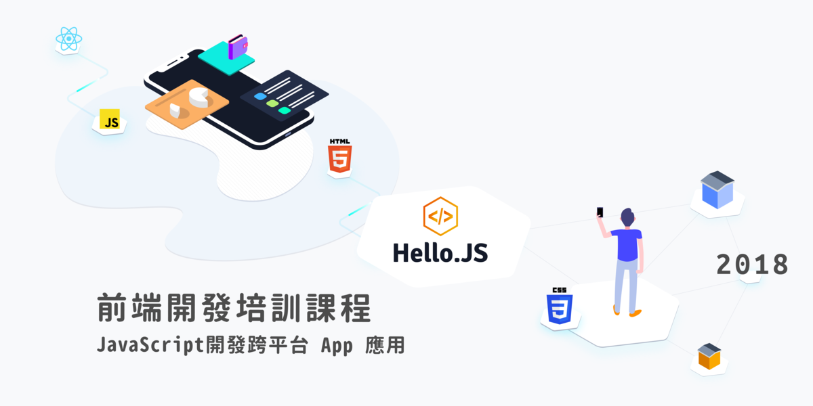

# 2018 HelloJS

## 課程特色

* 每次採用 Workshop 工作坊進行實戰，由業界技術專家現場實作輔導。
* 搭配業界最新採用的平台與開發工具，讓學習經驗無縫銜接未來職場需求。
* 提供 GitBook 編寫的數位教材，課程期間持續更新。
* 提供 Slack 團隊溝通平台，HelloJS 學員專屬頻道，課程內容即時討論與課後諮詢問答。
* 獨家開發 AgileWorks VM 教學系統，大幅簡化學習過程的開發環境建置。
* 強調以 Command-line 與 Ubuntu Linux 作業系統為主，學習經驗不受特定工具與平台限制。
* 進行專題實作，由導師進行輔導，於八月底完成培訓並交付實作成果，評選出優秀作品給予獎勵金。
* 開創職涯發展的起點，媒合優秀學員至專案合作企業面試，並提供簡歷撰寫與面試指導。

## 學習計畫

* 透過精心設計的目標導向式學習，讓你在一步步打造照片社群分享 App 的過程中，一次學會以下重點：
* 如何架構一款服務（Server + App）
* 如何使用 React Native 實作雙平台 App
* 如何使用 Node.js + Express 實作 Backend Server
* 如何養成良好的開發習慣
* 如何使用現代工具做線上溝通
* 如何參與小組專案多人遠端同步開發

## 學習地圖

* 第一週 - 7/13
    * 現代團隊工作法：溝通與表達的藝術
    * 入門基礎新法：淺談 Git/HTML5/CSS3/JavaScript

* 第二週 - 7/20
    * Node.js 與 React Native 初體驗

* 第三週 - 7/27
    * MVC 開發模式
    * 養成良好開發習慣

* 第四週 - 8/3
    * React Native App 實作

* 第五週 - 8/10
    * React Native 照片分享 App 實作〈一〉

* 第六週 - 8/17
    * React Native 照片分享 App 實作〈二〉

* 第七週 - 8/24
    * HelloJS hackthon 黑客松

* 第八週 - 8/31
    * 成果發表會＋hackthon 頒獎典禮