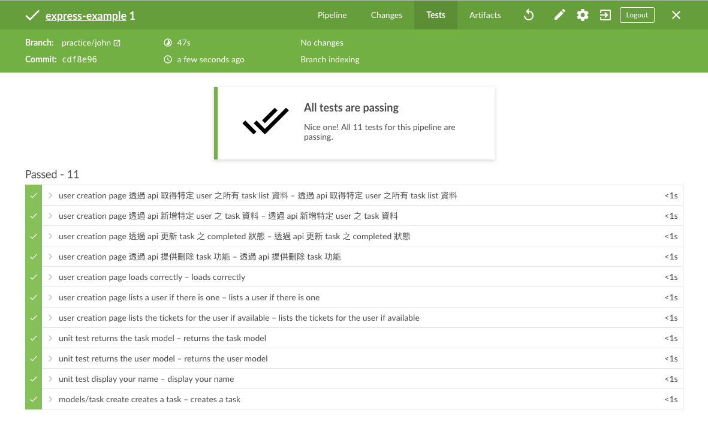

# API 新增刪除 Task 功能


## 新增 test 定義 task 刪除之 API spec

開啟 `<test/integration/user-creation-api.test.js>` 完成下面程式

```
  it('透過 api 提供刪除 task 功能', async function () {
    // 準備測試資料
    let username = 'frank test delete';
    let user = await this.models.User.create({
      username
    });

    let task = await this.models.Task.create({
      title: 'frank test delete',
      UserId: user.id,
      completed: false
    });
    
    user = await this.models.User.findOne({
      where: {username},
      include: this.models.Task
    });
    // 驗證測試資料正確建立
    expect(user.Tasks).to.be.an('array')
    expect(user.Tasks.length).to.be.equal(1);

    // 呼叫 API 
    // 使用 http method delete
    let response = await request(app)
      .del(`/api/task/${task.id}`);
    let result = response.body;

    // 確認 API 結果
    expect(result.task)
      .to.be.an('object')
      .and.to.have.property("title")
      .and.to.have.property("completed");

    // 確認資料已被刪除
    user = await this.models.User.findOne({
      where: {username},
      include: this.models.Task
    });

    expect(user.Tasks).to.be.an('array')
    expect(user.Tasks.length).to.be.equal(0);


  });
```

與一開始的 TDD 流程相同，再次運行 `npm run test`，會看到測試失敗

```
  1) user creation page
       透過 api 提供刪除 task 功能:
     Error: expected undefined to be an object
```

## 實作 task 刪除之 API

```
router.delete('/api/task/:id', async function (req, res) {
  // 接收從 url 傳入的參數
  let id = req.params.id;
  
  // 查出 id 對應的 task 
  let task = await models.Task.findOne({
    where: {id}
  });

  // 進行刪除
  task = await task.destroy();
  
  // 回傳刪除成功的資料內容
  res.json({task});
});
```

再次運行 `npm test`，將可以看到下面結果，測試已通過

`✓ 透過 api 提供刪除 task 功能`

將已完成的程式碼透過下面指令進行更新

```
git add .
git commit -m '完成刪除 task api 實作'
git push
```

## push 程式碼

執行

## 檢視 Jenkins 確認新增的刪除 API 通過自動化測試

因為之前已有設置 CI 自動化測試



## 啟動 Server

執行 `npm start` 啟動 server 令

## 解答

<https://github.com/agileworks-tw/express-example/pull/2>