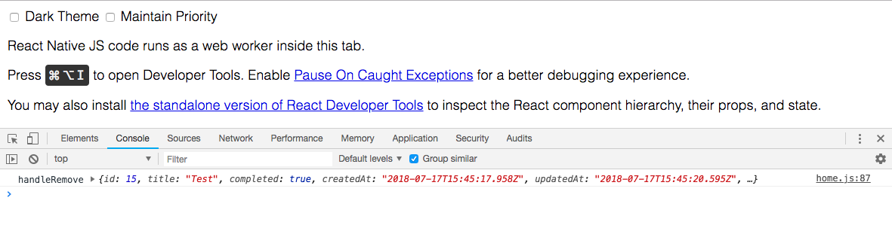
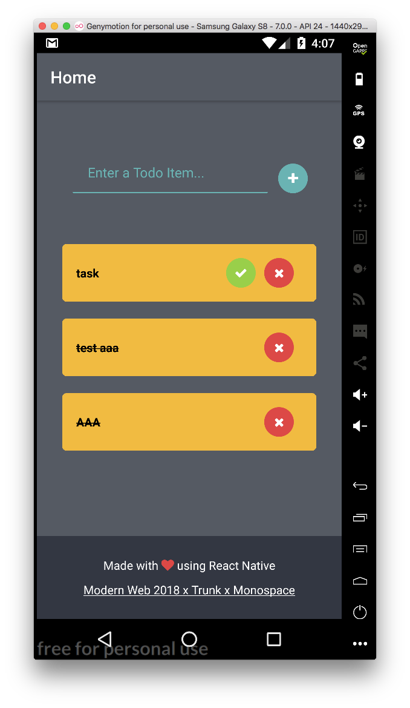
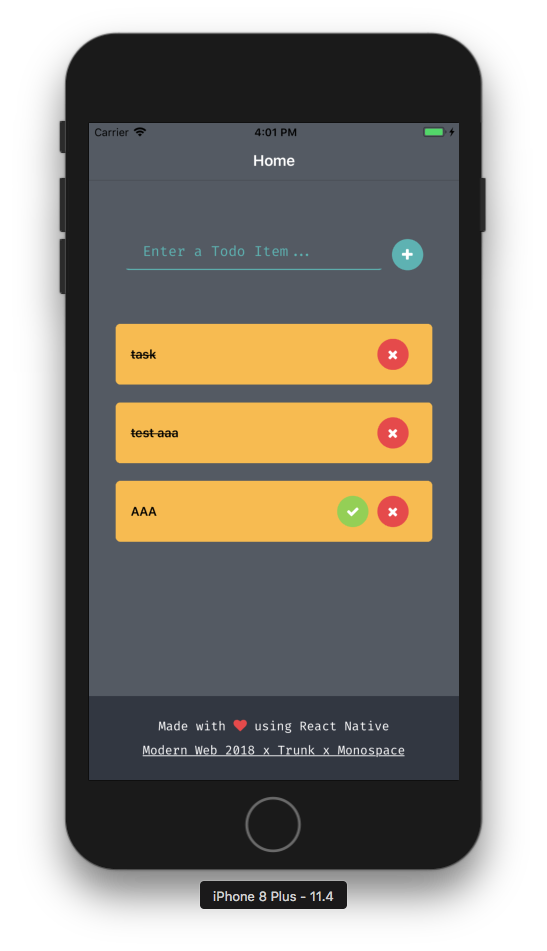

# React Native 新增 Task 刪除功能

## 運行 APP 

執行 `react-native run-android`

## 使用 chrome 進行 debug

瀏覽器開啟 <http://localhost:8081/debugger-ui/>

## 實作步驟

### 新增刪除按鈕，並將刪除函式綁定到按鈕按下事件

專案初始已先宣告預計要實作的函式，只先輸出 log

檢視專案中的 `app/views/home.js`
```
  handleRemove = async todo => {
    console.log("handleRemove", todo);
  };
```

把上面的函式指定到 `TodoList` 元件之 props，如下程式碼

```
    <TodoList
        data={todos}
        onPressComplete={this.handleComplete}
        onPressRemove={this.handleRemove}
    />
```

接著檢視 `app/components/TodoItem/TodoList.js`

上面加入的 `data, onPressComplete, onPressRemove` 透過下面程式碼傳入 `TodoItem`

```
props.data.map(todo => <TodoItem todo={todo} {...props} key={todo.id} />)
```

最後在檢視 `app/components/TodoItem/TodoItem.js`，其中要在下面的程式碼中加上刪除的文字，並且只有在 Todo 為 `isCompleted = ture` 才會顯示

```
      {isCompleted && (
        <View style={styles.btnGroup}>
        </View>
      )}
```

加入刪除按鈕


```
      {isCompleted && (
        <View style={styles.btnGroup}>
          <Button title="X" onPress={() => onPressRemove(todo)} />
        </View>
      )}
```

到此完成刪除按鈕的新增，檢視 <http://localhost:8081/debugger-ui/> 一旦點選刪除鈕後將會看到下面訊息



log 訊息正確輸出，針對 `handleRemove` 我們可以實作刪除的功能

### 實作刪除函式，當點下刪除按鈕時，刪除前端資料

檢視專案中的 `app/views/home.js`
```
  handleRemove = async todo => {
    console.log("handleRemove", todo);
  };
```

修改為

```
  handleRemove = async todo => {
    console.log("handleRemove", todo);
    const todos = this.state.todos;

    const updatedTodos = todos.filter(t => t.id !== todo.id);

    this.setState({ todos: updatedTodos });    
  };
```

透過 filter 取出沒有被刪除的 todos，該資料透過 `this.setState({ todos: updatedTodos }); ` 更新 state 會令 UI 進行 Render

將會看到點選刪除的 Todo 從 UI 上消失，但尚未與 API 串接，因此重整過後會回復原本未刪除的狀態。


### 實作刪除按鈕按下後，呼叫 API 將資料庫中對應的待做事項刪除

再次改寫上述函式，使用前面完成的刪除 API，參考 test spec 中 api 的呼叫方式

```
    // 呼叫 API 
    // 使用 http method delete
    let response = await request(app)
      .del(`/api/task/${task.id}`);
    let result = response.body;

    // 確認 API 結果
    expect(result.task)
      .to.be.an('object')
      .and.to.have.property("title")
      .and.to.have.property("completed");
```

handleRemove 改寫為

```
  handleRemove = async todo => {
    console.log("handleRemove", todo);
    const todos = this.state.todos;
    
    let response = await fetch(`${this.state.url}/api/task/${todo.id}`, {
      method: 'delete'
    });
    let result = await response.json();

    const updatedTodos = todos.filter(t => t.id !== todo.id);

    this.setState({ todos: updatedTodos });    
  };
```

至此完成 Todo 刪除的功能，並且資料透過 API 更新最新狀態到資料庫。

而因為 React Native 的特性，可以同時運作於 iOS 及 Android 作業系統





## 解答


<https://github.com/agileworks-tw/express-example-react-native/pull/1>
