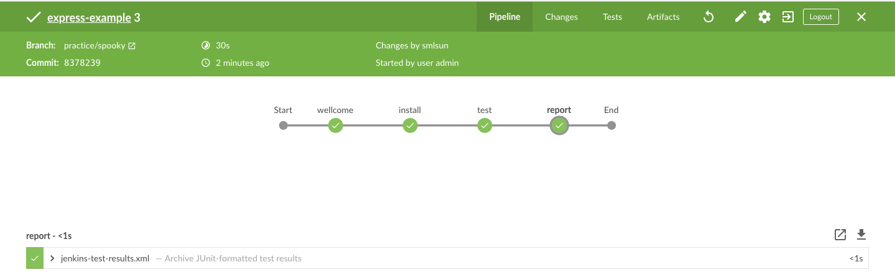
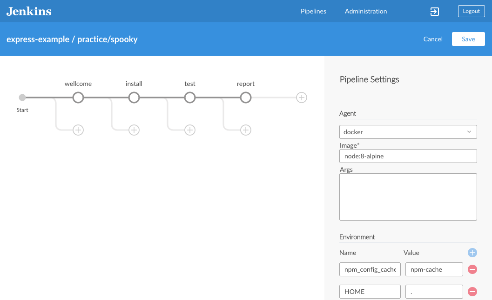
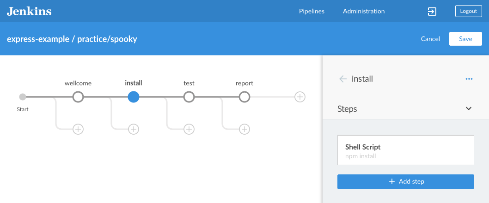
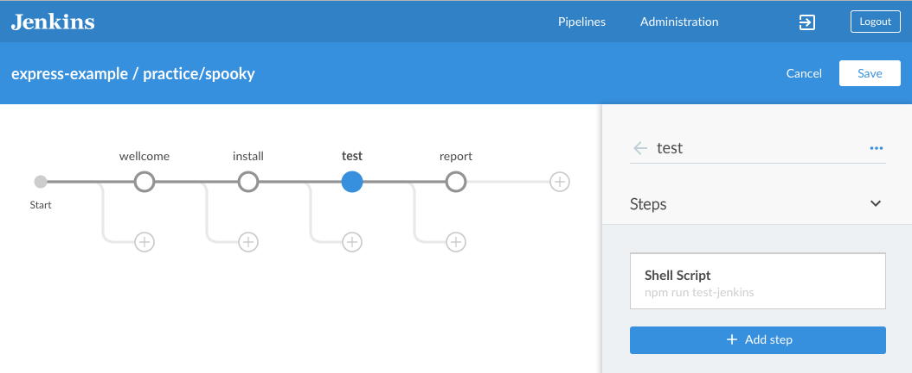
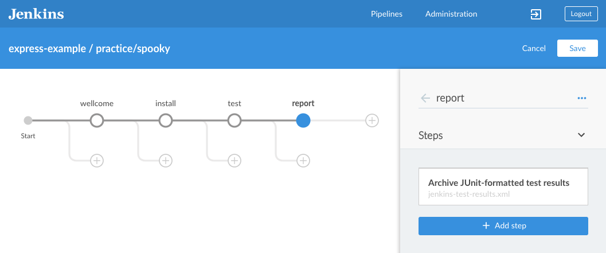
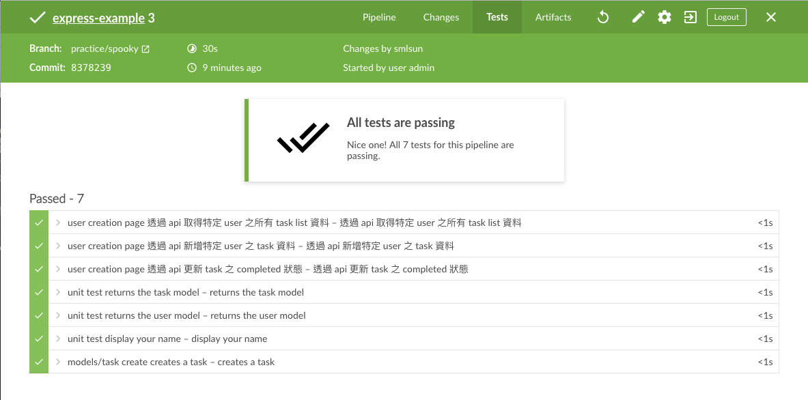

# 設置 CI 自動化測試流程

## 使用 Node Docker 作為建置環境

## 安裝專案套件

指令: `npm install`

## 執行測試

指令: `npm run test-jenkins`

## 產出報表

報表路徑: `jenkins-test-results.xml`

## 檢視報表

## 解答

<https://github.com/agileworks-tw/express-example/pull/3>