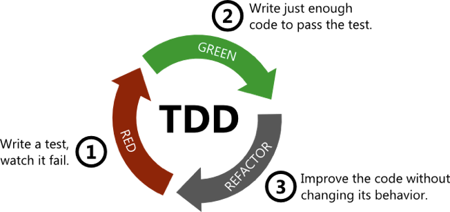

# DOJO 實作說明 


## 開始前準備


### api server

1. 進入 `express-example` 專案
2. 執行 `git checkout practice/005001_answer`
3. 執行 `git checkout -b practice/${yourname}`

### react native

1. 進入 `express-example-react-native` 專案
2. 執行 `git checkout practice/005002_base`
3. 執行 `git checkout -b practice/${yourname}`

### 第一個測試案例




#### 1. Write a test watch it fail

* 進入 `express-example` 專案
* 執行 `npm run test`

將會看到下面錯誤

```
  1) unit test
       display your name:
     Error: expected 'hello user' to equal 'yourname'
```

* 修正 `test/unit/index.test.js` 會看到如下程式碼 

```
  it('display your name', function () {
    var config = require('./../../config/config');
    expect(config.username).to.be.equal("john");
    require("../../dojo/dojo_start");
  });
```

其中

`expect(config.username).to.be.equal("yourname");`

`yourname` 可改為你的暱稱假設為 `John`，在運行一次 `npm run test`

```
  1) unit test
       display your name:
     Error: expected 'hello user' to equal 'John'
```

還是沒有通過，但此時我們可以看到，此測試案例已經預期要通過需要讓 `config.username` 等於 `John`

#### 2. Write just enough code to pass the test

此時我們可以修改系統設定檔 `config/config.js`，將 `username` 改為 `John`

```
module.exports = {
  username: "John",
  ...
};

```

在運行一次 `npm run test` 可以看到

```
unit test
    ✓ display your name
```

恭喜你完成第一個 TDD 循環

最後，我們可以執行下面指令將修改更新到 repo

```
git add .
git commit -m '完成使用者姓名驗證'
git push
```

## 實作功能說明

### Story

為了讓使用者可以將已完成的 Task 移除，需要讓標記已完成的 Task 可以被刪除

### 步驟

#### API 調整

* test spec: 新增 test 定義 task 刪除之 API spec
* implement: task 刪除之 API


#### APP 調整

* 新增刪除按鈕，並將刪除函式綁定到按鈕按下事件
* 實作刪除函式，當點下刪除按鈕時，刪除前端資料
* 實作刪除按鈕按下後，呼叫 API 將資料庫中對應的待做事項刪除


### 測試方式

* `使用者`可以在 APP 確認目前待做事項有哪些
* `使用者`在 APP 新增待做事項後，需要記錄在資料庫中，以便`使用者`再次查詢
* `使用者`可以在 APP 針對待做事項註記該項目是否已完成
* `使用者`可以在 APP 針對註記已完成的待做事項進行刪除


